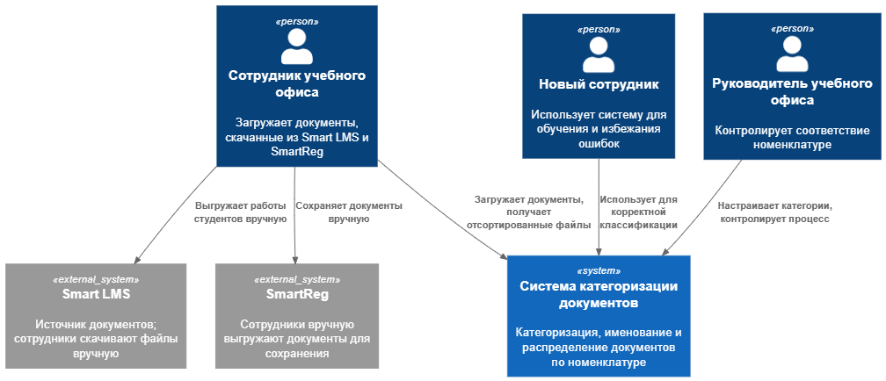
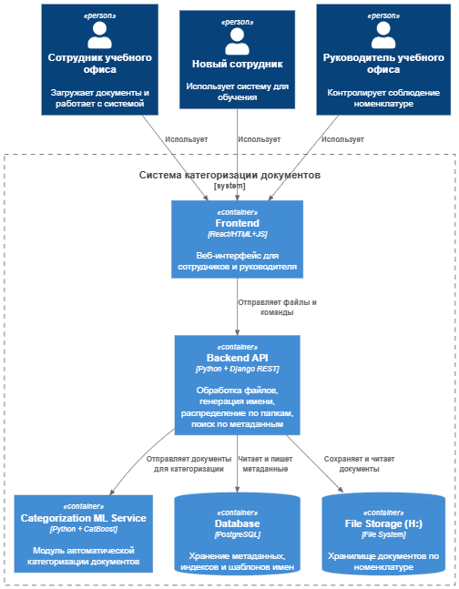
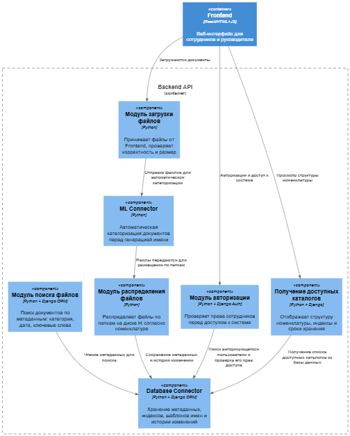
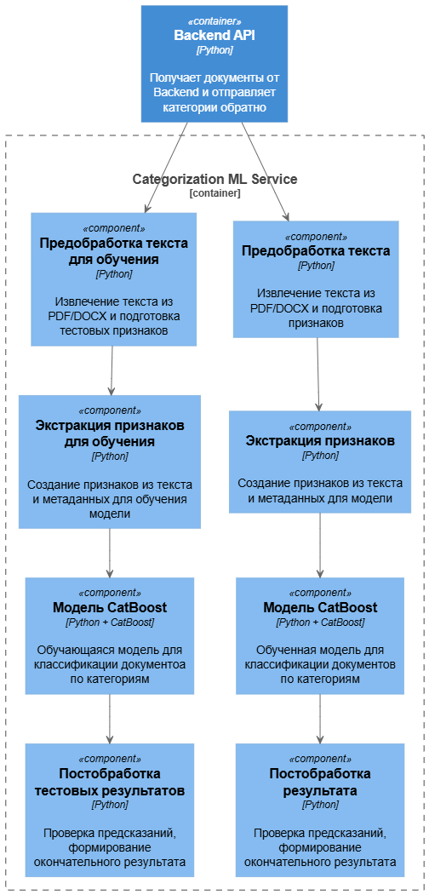

# Лабораторная работа №2
## Тема: Использование нотации C4 model для проектирования архитектуры программной системы
## Цель работы: Получить опыт использования графической нотации для фиксации архитектурных решений.
## Диаграмма системного контекста

## Диаграмма контейнеров

- **Frontend**
Назначение: Веб-интерфейс для сотрудников и руководителя (загрузка документов, просмотр результатов автоматической категоризации, ручная корректировка категорий, поиск).
Технологии: React/HTML+JS.
- **Backend API**
Назначение: Основная бизнес-логика это обработка файлов, генерация стандартных имен, распределение по папкам, поиск по метаданным.
Технологии: Python+Django REST.
- **Categorization**
Назначение: Модуль автоматической категоризации документов по тексту и метаданным, присваивает категории из номенклатуры.
Технологии: Python+CatBoost.
- **Database**
Назначение: Хранение метаданных документов, информации о категориях и шаблонов имен.
Технологии: PostgreSQL.
- **File storage (H:)**
Назначение: Физическое хранилище документов, распределенных по папкам согласно номенклатуре.
Технологии: Локальный сетевой диск H:
### Причины выбора базового архитектурного стиля
- Клиент-серверная архитектура (позволяет отделить пользовательский интерфейс от бизнес-логики, упрощает масштабирование и поддержку системы)
- REST API между Frontend и Backend (универсальный и стандартизированный способ обмена данными между веб-интерфейсом и сервером)
- Отдельный ML Service (позволяет интегрировать автоматическую категоризацию как отдельный компонент, при необходимости можно заменить на другую модель без изменений в Backend)
- Реляционная СУБД (PostgreSQL) (надежное хранение метаданных и категорий, поддержка транзакций и сложных запросов)
- Файловое хранилище (H:) (сохраняет совместимость с существующей структурой хранения документов в учебном офисе)
## Диаграмма компонентов
### Диаграмма компонентов: Backend

#### Описание компонентов:
- Модуль загрузки файлов (прием файлов от Frontend, проверка корректности)
- Модуль генерации названий файлов (генерация стандартизированных имен файлов по шаблону)
- Модуль распределения файлов (распределение файлов по папкам на H: согласно номенклатуре)
- Модуль поиска файлов (поиск документов по метаданным)
- ML Connector (Взаимодействие с ML-сервисом для автоматической категоризации)
- Database Connector (чтение и запись метаданных (названия, даты, типы документов, форматы файлов, категории, сроки хранений) в PostgreSQL)
- Модуль авторизации (проверка прав сотрудников)
- Модуль ручной категоризации (возможность вручную скорректировать категории для документов)
- Просмотр доступных каталогов (возможность ознакомиться с номенклатурой и структурой)
### Диаграмма компонентов: ML Service

#### Описание компонентов ML Service
- Предобработка текста (извлекает текст из файлов и формирует первичные признаки)
- Экстракция признаков (создает признаки для модели из текста и метаданных)
- МОдель CatBoost (классификация документов по номенклатурным категориям)
- Постобработка (проверка и корректировка предсказаний модели перед отправкой в Backend)
- Backend Connector (прием документов от Backend и возврат категории обратно)